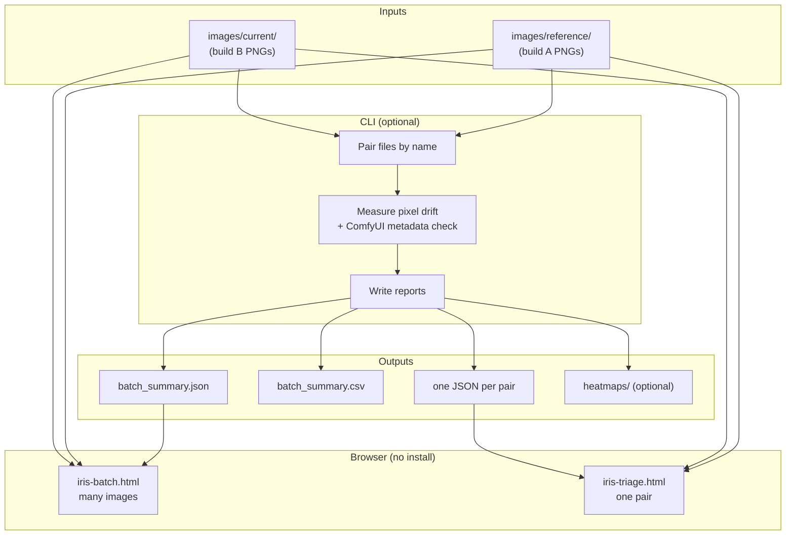
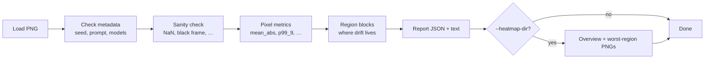

# IRIS — Image Regression Inspection Suite

Compare images from two ComfyUI builds and see how much they drift at the pixel level. Same workflow + seed should produce nearly the same picture; IRIS measures the difference and tells you which files match.

## How it flows



**Two paths:**

| Path | You do | IRIS gives you |
| --- | --- | --- |
| **Browser only** | Open HTML, pick two folders or upload JSON | Summary on screen — nothing installed |
| **CLI + browser** | Run batch compare, then open dashboard | JSON/CSV on disk + richer batch view |



## Generated files (visual guide)

When you use `--heatmap-dir`, IRIS writes readable PNGs alongside the JSON report:


| File | What it shows |
| --- | --- |
| `overview_reference_vs_current.png` | Whole-frame difference map (colour + scale legend) |
| `worst_region_1.png` | Zoomed **reference \| current \| difference** for the worst patch |
| `detection_*.png` | Optional — boxes around prompt objects (`--detect-backend owlv2`) |
| `report.json` / `report.txt` | Numbers + plain-language summary |

Batch mode output folder:

```
reports/
├── batch_summary.json    ← load in iris-batch.html
├── batch_summary.csv
├── comfyui_chroma__seed_123.json
├── comfyui_flux__seed_456.json
└── …
```

## Try it in the browser (no install)

Open [iris-batch.html](https://tejashsn.github.io/iris/iris-batch.html?demo=1) for a pre-loaded demo, or open these files locally:

| File | Use for |
| --- | --- |
| [index.html](index.html) | Landing page |
| [iris-batch.html](iris-batch.html) | Compare many images at once (batch) |
| [iris-triage.html](iris-triage.html) | Compare one image pair (drag & drop) |

Everything runs in your browser. Images never leave your machine.

## Install (CLI)

```bash
pip install -e ".[dev]"
```

Needs Python 3.10+ and only `numpy` + `Pillow`. No GPU required.

## Compare one image pair

```bash
iris-compare \
  --reference ref.png \
  --current nightly.png \
  --threshold 1.0 \
  --heatmap-dir visuals \
  --out report.json
```

`--threshold` is required. Add `--heatmap-dir` to get the overview and worst-region PNGs (see [Generated files](#generated-files-visual-guide) above).

## Compare two folders (batch)

Put reference PNGs in one folder and current-build PNGs in another. Filenames must match (same workflow + seed name).

```bash
python -m iris.cli \
  --reference-dir images/reference \
  --current-dir images/current \
  --threshold 1.0 \
  --out reports/
```

This writes:

- `batch_summary.json` — summary for the batch dashboard
- `batch_summary.csv` — spreadsheet-friendly version
- one JSON report per matched image pair

Then open `iris-batch.html` and upload `batch_summary.json`, or load it from a hosted site (see below).

## Host on a web server

1. Copy the project (or `iris-static-deploy.zip`) to your web root.
2. Copy `config.json.example` to `config.json` and edit paths if needed.
3. Put PNGs in `images/reference/` and `images/current/` (filenames must match the report).
4. Put `batch_summary.json` in `reports/`.

Example URL: `http://your-server/iris-batch.html?report=reports/batch_summary.json`

See [deploy/nginx-iris.conf](deploy/nginx-iris.conf) for an nginx example.

## What the numbers mean (short version)

| Metric | Plain English |
| --- | --- |
| `mean_abs` | Average RGB difference (0–255 scale) |
| `p99_9` | Worst-case tail — catches small broken patches |
| `pct_over_t` | % of pixels above your threshold |
| `bitwise_identical` | Exact same file — skip the rest |

Healthy cross-GPU drift on one build is often around **0.3–0.6** mean abs. A different seed gives much higher numbers (~57–84). IRIS checks ComfyUI PNG metadata first so you know the prompt and seed actually match.

## Optional: pass / fail gates

IRIS does not pick thresholds for you. To fail a CI job when drift is too high:

```bash
iris-compare \
  --reference ref.png \
  --current nightly.png \
  --threshold 1.0 \
  --max-mean-abs 0.8 \
  --max-p99-9 4.0 \
  --gate-exit \
  --out report.json
```

## Development

```bash
pip install -e ".[dev]"
pytest
```

## More detail

For metrics definitions, provenance checks, heatmaps, optional semantic backends, and calibration notes, see the source under `src/iris/`.
